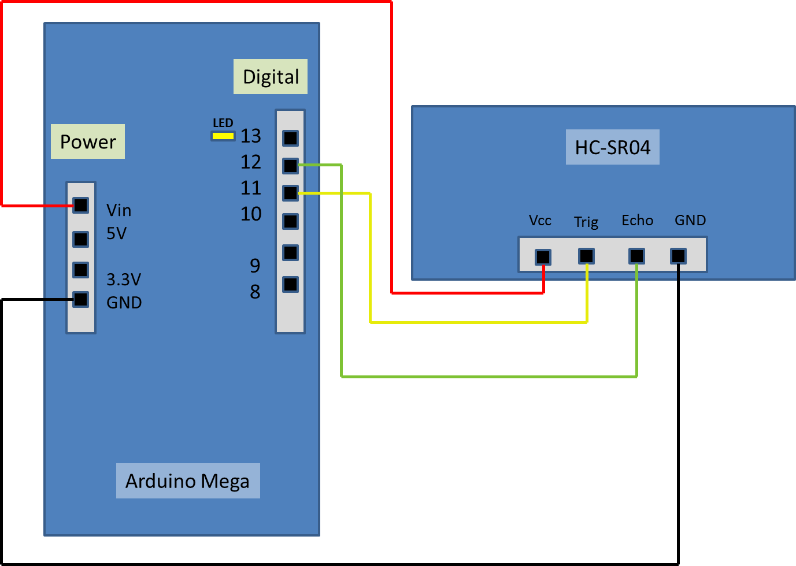
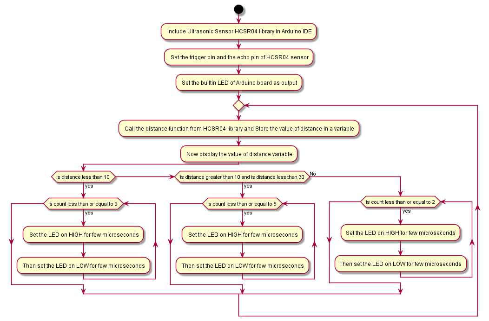

# distance_hcsr04

- Objective:

    To create an Arduino sketch for Arduino Mega 2560 to read measurements of ultrasonic sensor (HC-SR04) using its library.

The repository consists of following files:

- Assets: 

    Assets are flowchart files. We created our flowchart for the task using Plantuml and stored it here.

- Connection Diagram:

    It is an image which represents a proper connection for the circuit to get our required output.

- Source:

    It is a working source for the task. It can be pulled and modified on any time in future.

Following is the Connection Diagram for the Working Model:

Here, we used BUILTIN LED from 13th pin to blink in various pattern based on the distance between the sensor and the object.

The different types of LED pattern based on the distance are:

	Below 10 cm         – Blink fast with duty cycle 75% (10 times)
	Between 10-30 cm    – Blink slow with duty cycle 50% (6 times)
	Above 30 cm         – Blink slow with duty cycle 25% (3 times)

Following is the flowchart for the working Source:

